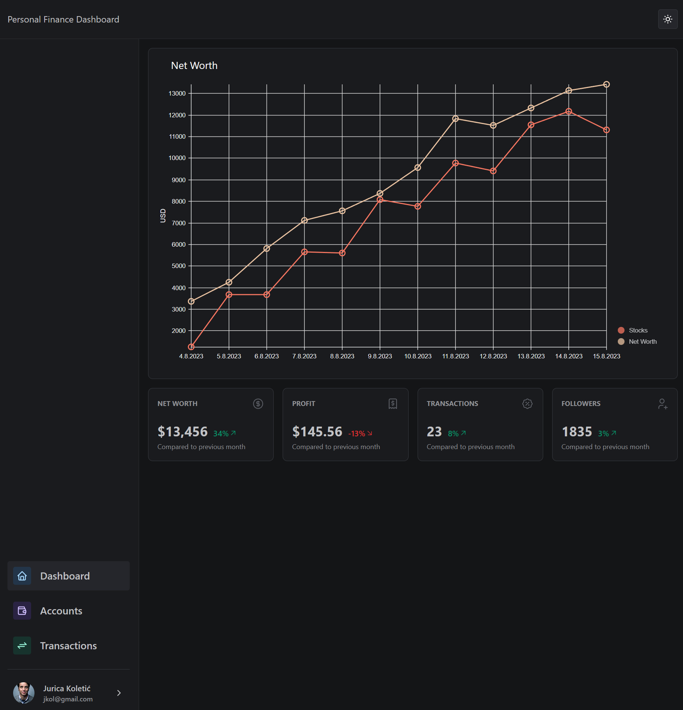

# PersonalFinanceDashboard

PersonalFinanceDashboard is the working title of this project which is intended to be a dashboard to track ones personal finances. The idea is to be able to track bank accounts, credit cards, investments and similar assets through one single application. I plan to include tools for budgeting, analyzing spending habits, and tracking investments.

## Development Status

This project is in an early development stage and not yet ready for use ;)

## Why another personal finance app?

I grew a little dissatisfied with the personal finance apps I have used so far. Either they are too complex, have horrible UX or simply lack features. While building such an app will be a lot of work, and will most likely take a lot of time, I want to challenge myself and see if I can build something that I would actually use myself.

## Progress

Here is a very early impression of the application. Keep in mind that most of what you see is no where near a finished state:

