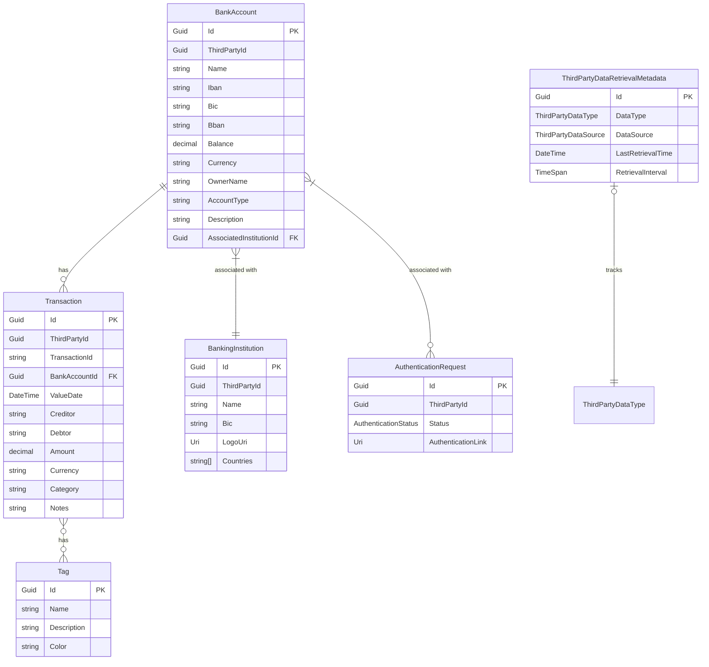

# Database Schema

The application uses a relational database to store financial data. Below is the entity-relationship diagram showing the main entities and their relationships:

## Entity Descriptions

### BankAccount

Represents a bank account with its basic information like IBAN, balance, and currency. Each account is associated with a banking institution and can have multiple authentication requests.

### Transaction

Stores financial transactions linked to bank accounts. Each transaction has details about the amount, currency, parties involved (creditor/debtor), and can be tagged for categorization.

### Tag

Allows categorization of transactions through a many-to-many relationship. Tags have a name, description, and can be color-coded for visual distinction.

### BankingInstitution

Contains information about banks and financial institutions, including their BIC (Bank Identifier Code) and supported countries.

### AuthenticationRequest

Tracks authentication status with third-party data providers.

### ThirdPartyDataRetrievalMetadata

Manages the synchronization of data with third-party data providers by tracking when data was last retrieved and how often it should be updated.
