# Portfolio Performance

Portfolio Performance is a "open source tool to calculate the overall performance of an investment portfolio - across all accounts".

## Features

- Record full history of transactions, purchases, sales, taxes, fees, etc.
- Calculate performance indicators such as the True-Time Weighted Rate of Return or the Internal Rate of Return (IRR)
- Update historical quotes from a variety of sources: Yahoo Finance, Finnhub.io, Quandl, or AlphaVantage (very interesting, should look at what these sources offer!)

## Notes

- Getting free stock data also seems to be a problem of the developer of Portfolio Performance, see [Documentation (German)](https://help.portfolio-performance.info/kursdaten_laden/)
  - Uses Yahoo Finance and Alpha Vantage where possible
  - Alternative: manual import via CSV or URL to price data

## Screenshots

Source for Screenshots: [YouTube](https://www.youtube.com/watch?v=F0VWJM_B4FI)

### Adjustable Dashboard

Dashboard can be created and adjuted through simple drag and drop:

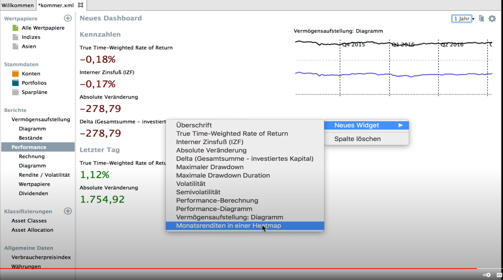

### Networth History

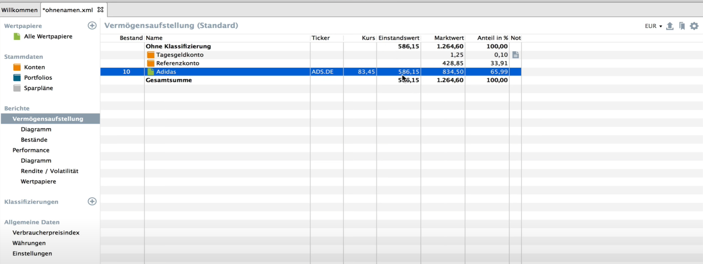
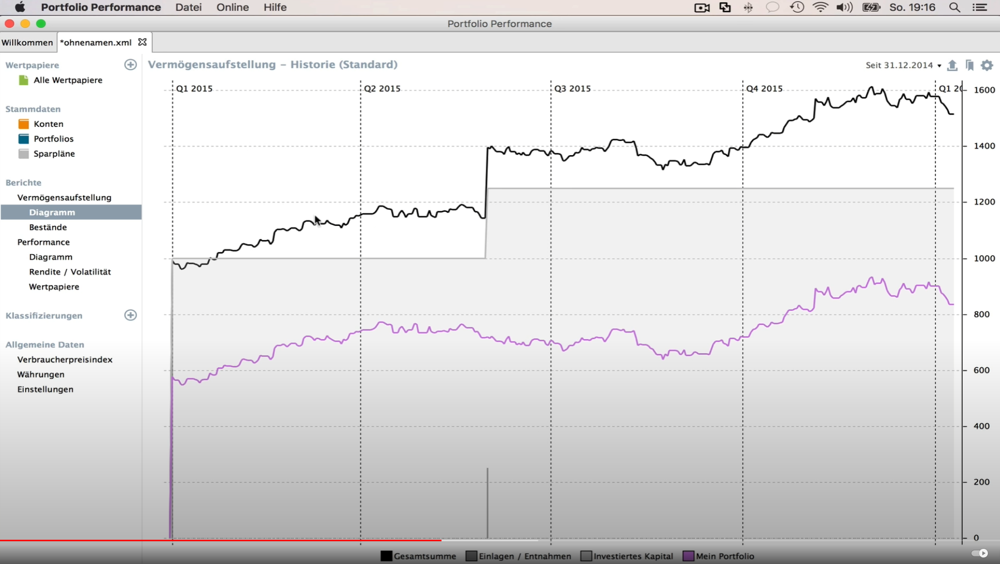

### Transactions

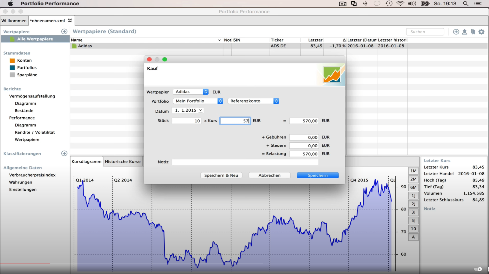

### Allocation Chart

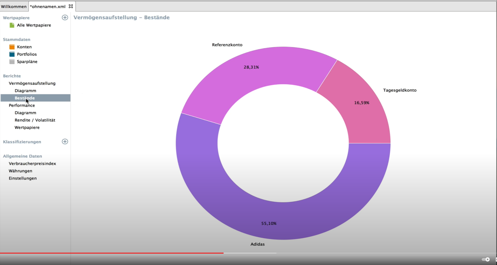

### Performance

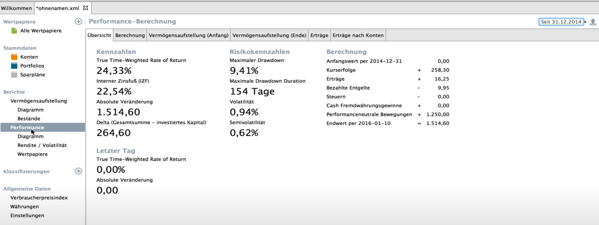
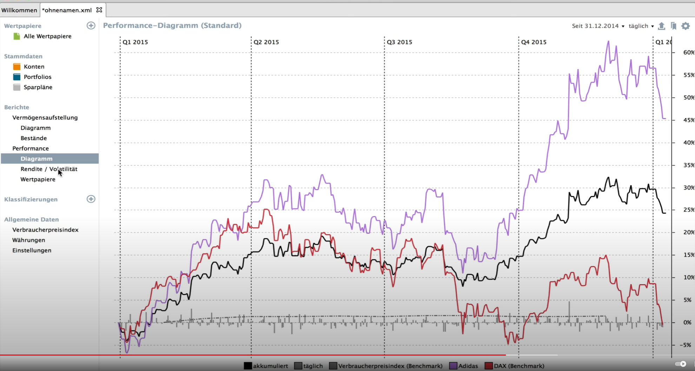

### Asset Classes (Interesting!)

Creating user defined categories which then can be viewed through different diagrams:

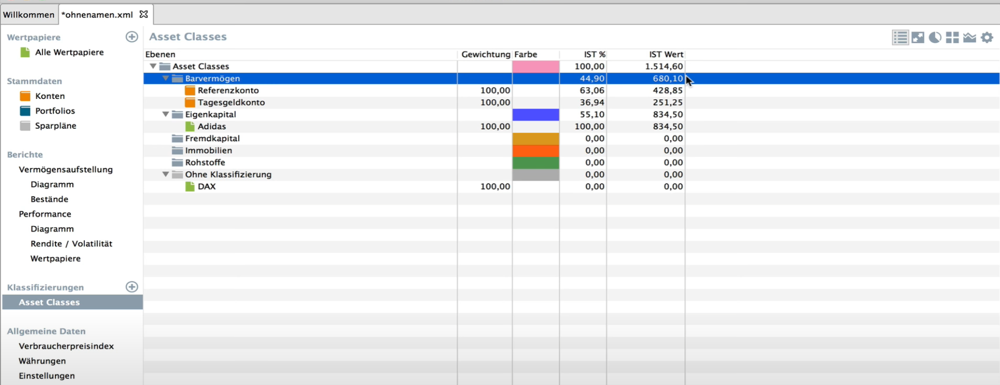
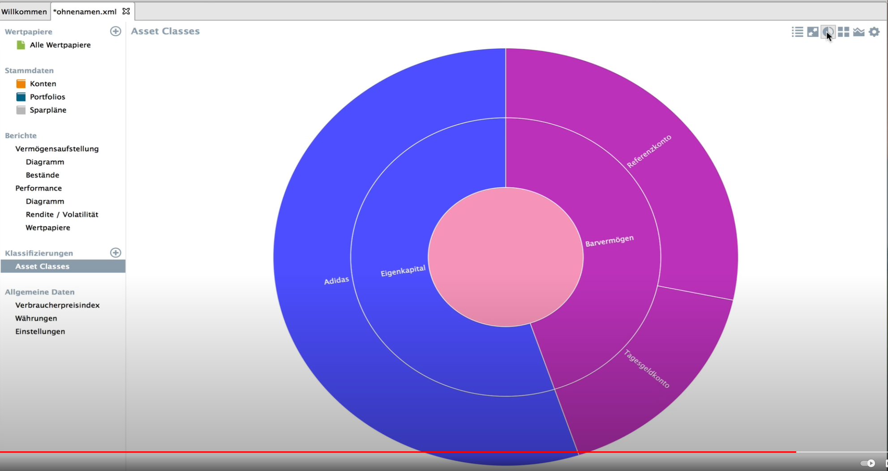
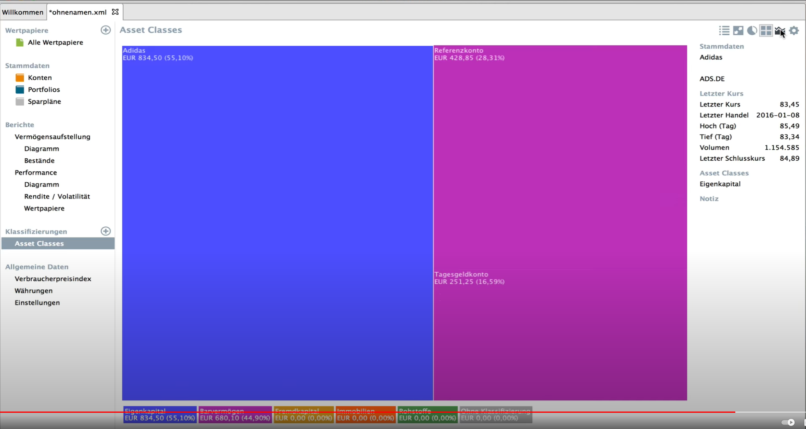
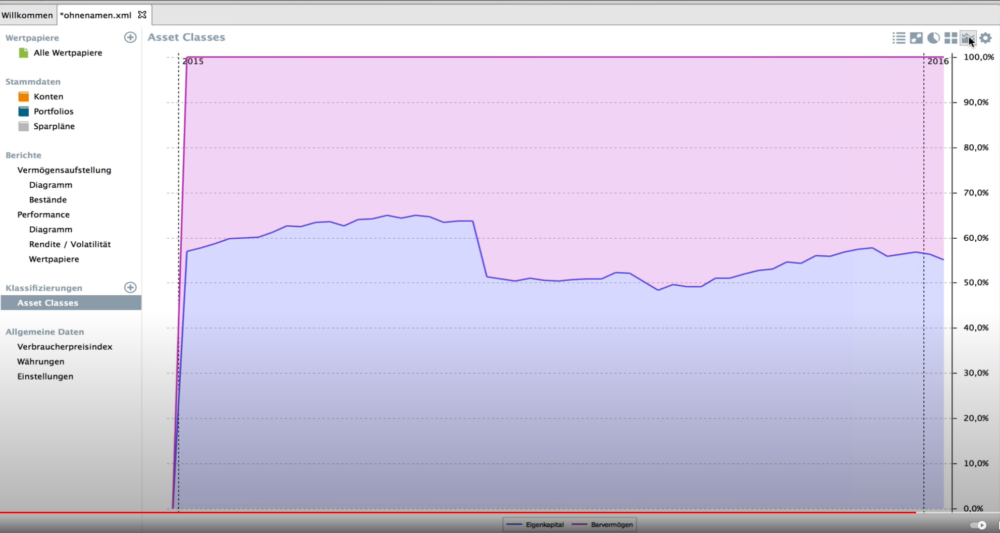
