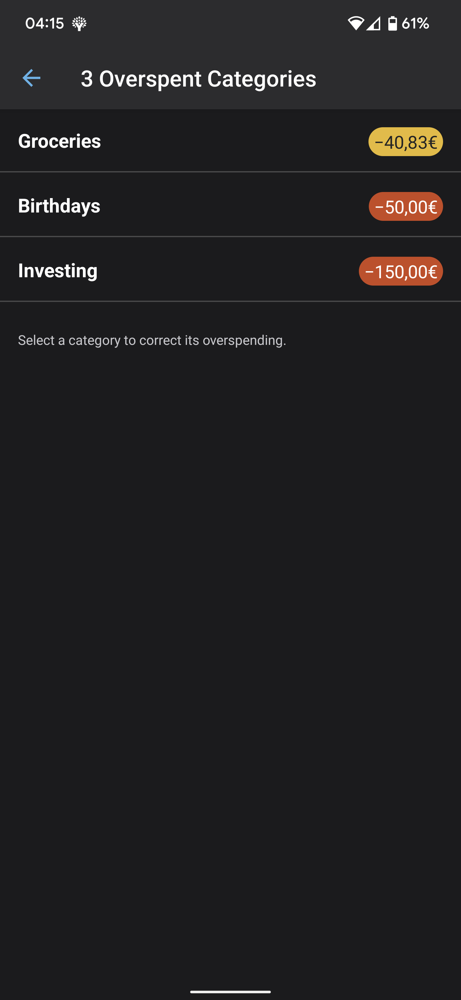

# YNAB (You Need A Budget)

Multi-platform personal budgeting program based on the envelope method.

## Features

- creating/editing transactions, accounts, giving them budgets and categories
- automating recurring transactions
- auto assigning budgets to categories
- Automatic import of bank transactions via [TrueLayer](https://www.truelayer.com/)

### Bookkeeping System

- Zero-based 'envelope' budgeting

### Platforms

- Web App, Android, iOS

## Screenshots

### Budget

#### Category with money left over

#### Category which is overspent

#### Category which is overspent on credit

### Reports

#### Net Worth Chart

#### Spending Totals Chart

- Sub-categories can be inspected by clicking on the respective category
- I don't like that you cannot easily tell the categories before hovering over them (you need to look at the side panel!)

#### Spending Trend Chart

#### Income vs Expenses Chart

### All Accounts

#### Adding a Transaction

### Single Account View

### Adding an account

### Dark Mode

### Budget Settings

### Mobile

#### Login

#### Accounts

#### Budget

#### Link

#### Overspent Category

