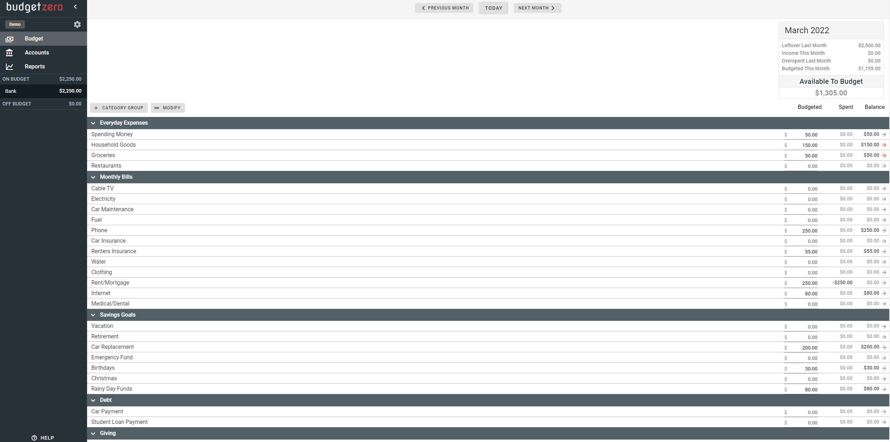
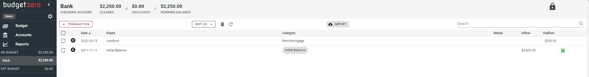
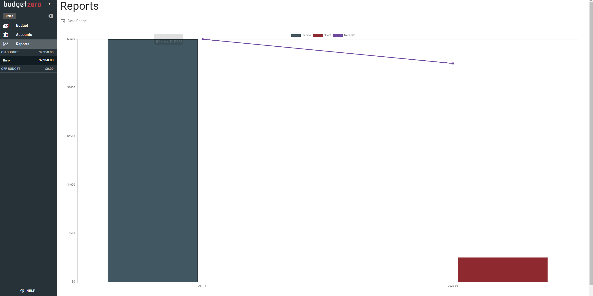

# budgetzero

budgetzero is a "free, open-source, privacy-friendly, offline-first budgeting system".

## Features

- Offline-first storage. **All data is stored in the browser** (via [pouchdb](https://pouchdb.com/), optional sync via [couchdb](https://couchdb.apache.org/))
- Import Transactions (OFX, QFX, CSV)
- Carry negative balances into next month
- Privacy-focused. Zero trackers & zero analytics.

### Bookkeeping System

- Zero-based 'envelope' budgeting

### Deployment options

- Server
- Docker

### Notes

- Generally not very intuitive to use
- Weird UI behavior (shifting rows after entering values, irritating UI interactions, etc.)
- Kind of YNAB lite
- Very positive: can just be used via hosted instance from dev, since it doesn't required any big resource load => something like github pages would suffice

## Screenshots

### Budget

### Account

### Reports

